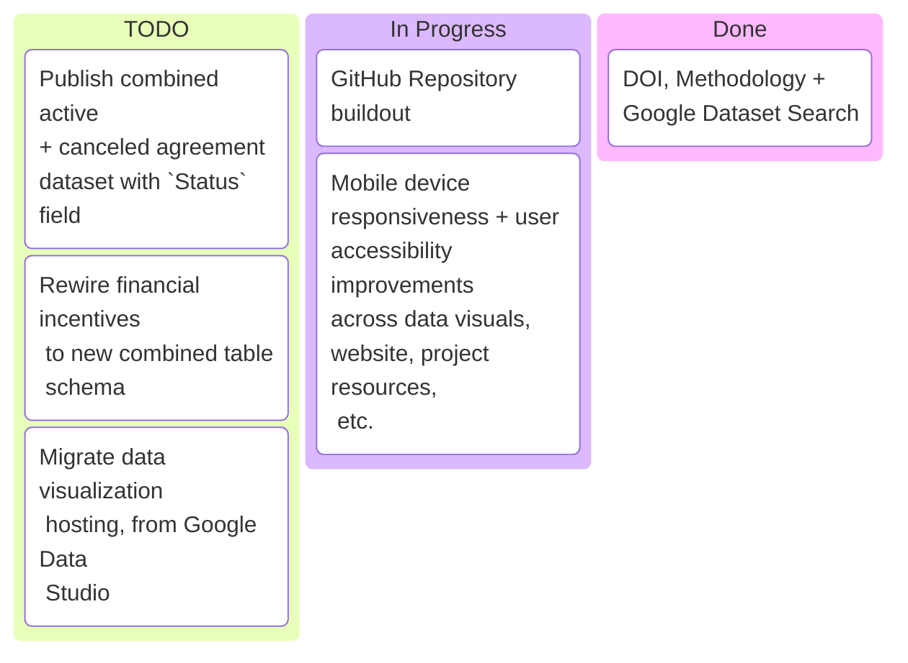

# Project Roadmap

```mermaid

kanban
  TODO
    ["Publish combined active </br>+ canceled agreement</br>dataset with `Status` field"]
    ["Rewire financial incentives</br> to new combined table</br> schema"]
    ["Migrate data visualization</br> hosting, from Google Data</br> Studio"]
  In Progress
    [GitHub Repository buildout]
    ["Mobile device </br>responsiveness + user </br>accessibility improvements </br>across data visuals,</br>website, project resources,</br> etc."]
  Done
    ["DOI, Methodology + </br>Google Dataset Search"]
```
---
