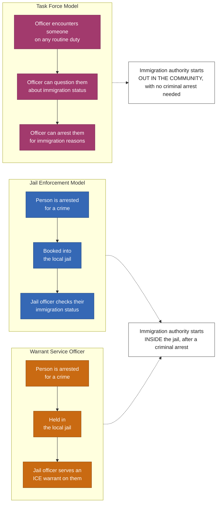

```mermaid
flowchart LR
    subgraph JEM ["Jail Enforcement Model"]
        direction TB
        J1["Person is arrested<br/>for a crime"] --> J2["Booked into<br/>the local jail"] --> J3["Jail officer checks their<br/>immigration status"]
    end
    subgraph WSO ["Warrant Service Officer"]
        direction TB
        W1["Person is arrested<br/>for a crime"] --> W2["Held in<br/>the local jail"] --> W3["Jail officer serves an<br/>ICE warrant on them"]
    end
    subgraph TFM ["Task Force Model"]
        direction TB
        T1["Officer encounters someone<br/>on any routine duty"] --> T2["Officer can question them<br/>about immigration status"] --> T3["Officer can arrest them<br/>for immigration reasons"]
    end
    K["Immigration authority starts<br/>INSIDE the jail, after a criminal arrest"]
    L["Immigration authority starts<br/>OUT IN THE COMMUNITY, with no criminal arrest needed"]
    JEM -.-> K
    WSO -.-> K
    TFM -.-> L
    classDef jem fill:#3568b5,stroke:#24497f,color:#ffffff
    classDef wso fill:#c96a12,stroke:#8d4a0c,color:#ffffff
    classDef tfm fill:#a23a6d,stroke:#7a2a52,color:#ffffff
    classDef note fill:#ffffff,stroke:#555555,color:#222222
    class J1,J2,J3 jem
    class W1,W2,W3 wso
    class T1,T2,T3 tfm
    class K,L note
```
